🧠 Neurea — Flutter Mental Health App

A production-ready Flutter application built to support emotional well-being and mental health. Focused on AI-powered therapy chatbot, professional therapist booking, daily mood tracking, and interactive breathing & focusing exercises. Also includes mini games for stress relief and crisis support features for added safety. Supports dark mode and clean user experience. Built with Clean Architecture, Cubit (BLoC) state management, and Firebase for authentication, real-time chat storage, and user data management.

⚡ Built to demonstrate real-world Flutter development practices: scalable structure, clean separation of concerns, and robust state handling.

📱 Screenshots

<<<<<<< HEAD
| Home | Mood Tracking | Notification |
|------|-------------|-----------|
| 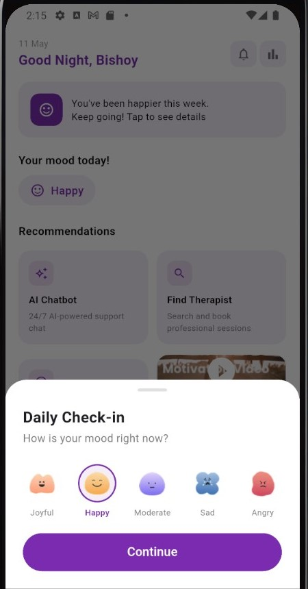 |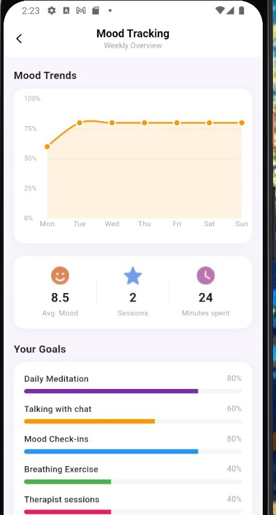 | 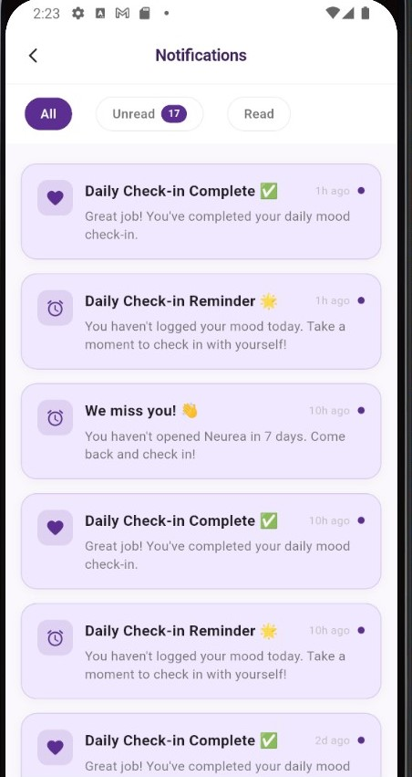 |

| Therapists |Therapists details| profile |
|-----------|-----------|---------|
| 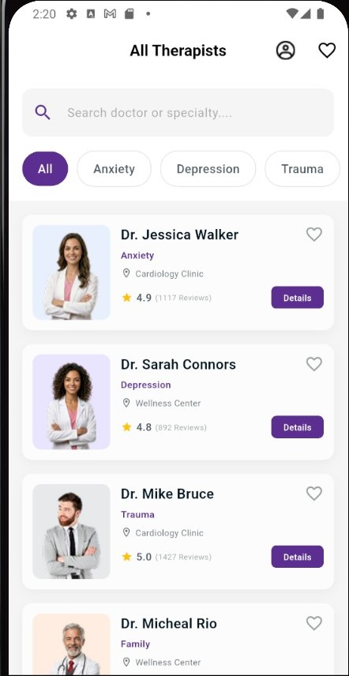 | 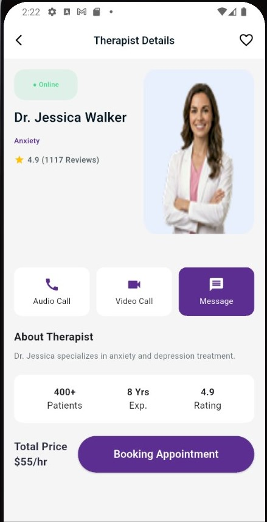 | 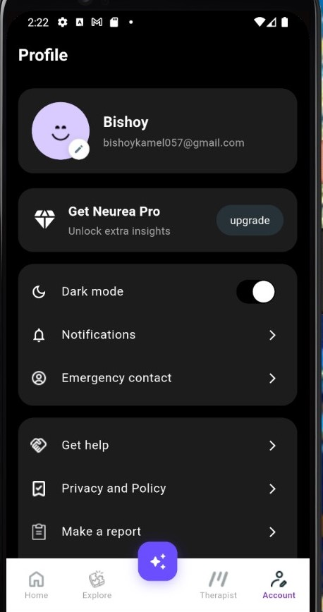 |

| MiniGames | Breasing |Focusing|
|-----------|-----------|---------|
| 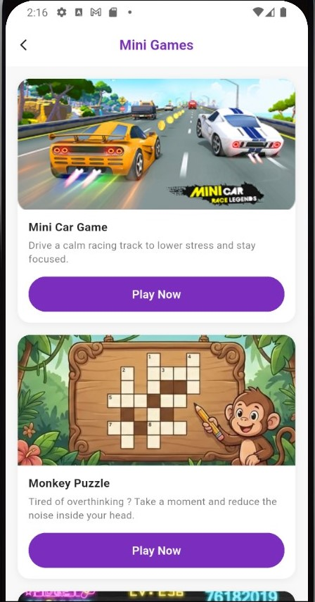 | 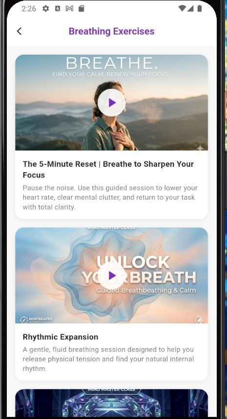 | 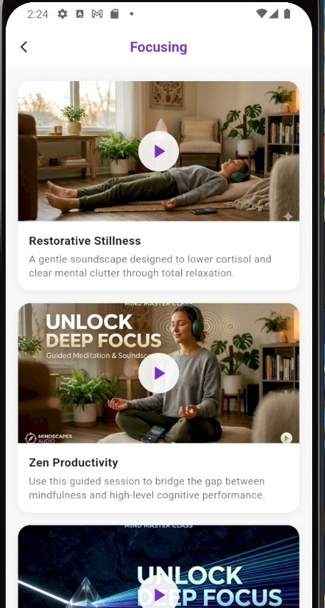 |

| Chatbot | Chatbot |
|-----------|-----------|
| 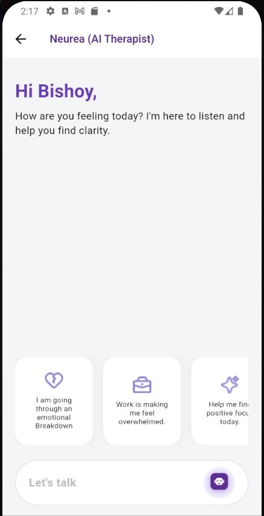 | 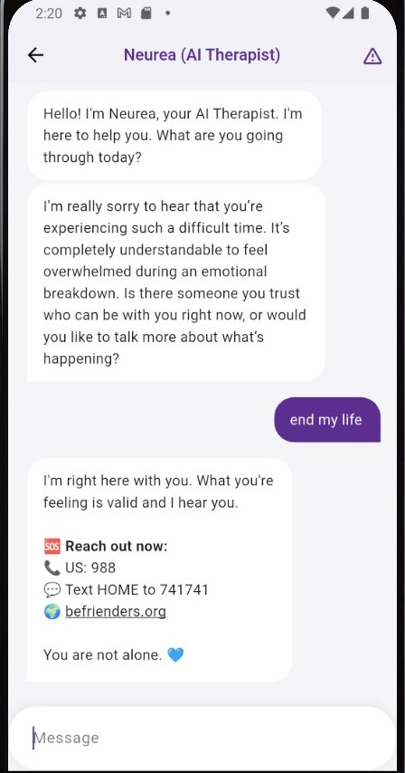 | 

✅ Key Features

🤖 AI Therapy Chatbot — Talk to an AI assistant trained to support mental health conversations
👨‍⚕️ Professional Therapist Booking — Browse and book sessions with licensed therapists
📊 Daily Mood Tracking — Log your mood and visualize your emotional patterns over time
🌬️ Breathing Exercises — Guided breathing sessions linked to YouTube for calm and focus
🎯 Focusing Sessions — Curated audio journeys to improve concentration and mindfulness
🎮 Mini Games — Stress-relief games including a car game, word puzzle, and fidget spinner
🆘 Crisis Support — Quick access to emergency mental health resources

🛠️ Tech Stack

| Layer | Technology |
| Framework | Flutter (Dart) |
| State Management | Bloc / Cubit|
| Networking | Dio |
| Authentication | Supabase |
| Database & Storage | Supabase (chat history) |
| Edge Functions | Supabase Edge Functions (chatbot) |
| AI Disease Detection | FastAPI (backend) |
| Architecture| Clean Architecture (Feature-first) |
| Error Handling| Custom API error handling layer |
| shared_preferences | Local data persistence |

🏗️ Project Structure

lib/
├── core/
│   └── presentation/
│       └── screens/
│           ├── account_Notification.dart
│           ├── chatbot_conversation_screen.dart
│           ├── chatbot_welcome_screen.dart
│           ├── crisis_support_screen.dart
│           ├── Emergency_Contact_profile.dart
│           ├── Help_Center_Screen.dart
│           ├── Make_Report_Screen.dart
│           ├── Notification_Helper.dart
│           ├── notifications_screen.dart
│           ├── Privacy_Policy_Screen.dart
│           ├── pro_profile.dart
│           ├── profile_screen.dart
│           └── Profile_Settings_Screen.dart
│
├── cubit/
│   ├── auth/
│   ├── chat/
│   ├── mood/
│   ├── notification/
│   ├── payment/
│   ├── profile/
│   └── therapists/
│
├── features/
│   ├── auth/
│   └── splash/
│
├── Home/
│
├── Medicain/
│   └── Care_Plan_Screen.dart
│
├── payment/
│   ├── Add_Card_Screen.dart
│   ├── Payment_Failure_Screen.dart
│   ├── Payment_Screen.dart
│   └── Payment_Success_Screen.dart
│
├── Service/
│   ├── Auth_Service.dart
│   └── chatbot_service.dart
│
├── therapists/
│   └── presentation/
│       └── screens/
│           ├── favorite_therapists_screen.dart
│           ├── therapist_chat_screen.dart
│           ├── Therapist_Chat_With_Messages_Screen.dart
│           ├── therapist_details_screen.dart
│           ├── Therapist_list_Card.dart
│           ├── therapist_review_screen.dart
│           ├── therapist_video_call_screen.dart
│           ├── therapist_voice_call_screen.dart
│           └── therapists_list_screen.dart
│
└── main.dart

🚀 Getting Started
git clone https:https://github.com/Bishoy678/neurea.git
cd neurea
flutter pub get
flutter run

Requirements: Flutter SDK 3.x+, Android Studio or VS Code

👨‍💻 Author

Bishoy Kamel — Flutter Developer

⭐ If you found this useful, please give it a star on GitHub!
